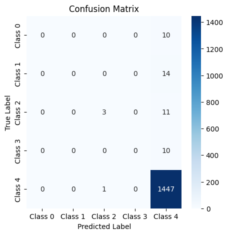
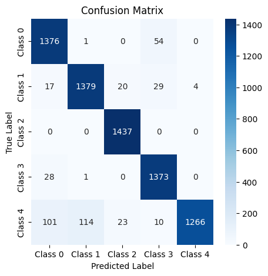

Ceci est le fruit du travail de Jade MELLITI et Alexandra BARON. 

# Rapport de Projet - Maintenance Prédictive sur STM32L4R9

## Table des Matières
1. [Introduction](#introduction)
2. [Objectifs](#objectifs)
3. [Architecture du Projet](#architecture-du-projet)
4. [Méthodologie](#méthodologie)
5. [Résultats Clés et Analyse des Performances](#résultats-clés-et-analyse-des-performances)
6. [Conclusion](#conclusion)
7. [Guide d'utilisation](#guide-d-utilisation)

## Introduction
Ce projet vise à concevoir, entraîner et déployer un réseau de neurones profond (DNN) en Python pour la maintenance prédictive, en utilisant le jeu de données **AI4I 2020 Predictive Maintenance Dataset**. L'objectif final est d'exporter le modèle pour une exécution sur une carte **STM32L4R9**.

## Objectifs
1. **Prétraitement des données** : Nettoyage et équilibrage du dataset.
2. **Conception et entraînement du modèle** : Architecture DNN optimisée.
3. **Évaluation des performances** : Métriques de classification et matrice de confusion.
4. **Conversion pour cible embarquée** : Export au format TFLite.
5. **Intégration sur STM32** : Déploiement via STM32CubeIDE.

## Architecture du Projet

  <strong>IA_EMBARQUE/</strong>
  

    ├── 📂 <strong>Firmware</strong>
    

      ├── 📁 App 
      └── 📁 Core_Src
    

    ├── 📂 <strong>images</strong> 
    └── 📂 <strong>Jupiter</strong>
  

## Méthodologie

### 1. Analyse et Prétraitement des Données
- **Dataset** : 10 000 échantillons de capteurs industriels avec 5 types de pannes.
- **Problématique** : Déséquilibre majeur entre classes.
- **Solutions** :
  - Suppression des pannes aléatoires (*RNF* non prévisibles) et des pannes non prévues.
  - Rééchantillonnage via **SMOTE** pour équilibrer les classes.

### 2. Architecture du Modèle
- **Modèle DNN** : 
  - Couches denses (64 neurones, ReLU) + Softmax en sortie.
  - Loss : `categorical_crossentropy`, Optimiseur : Adam.
- **Résultats avant équilibrage** : 
  - Modèle biaisé vers la classe majoritaire qui est Non Failure.   
- **Après SMOTE** :
  - Accuracy équilibrée.
  - Matrice de confusion montrant une bonne détection des pannes.   

### 3. Déploiement sur STM32
- **Conversion** : Modèle exporté en `.tflite` via TensorFlow Lite.
- **Intégration** : 
  - Utilisation de **X-Cube-AI** pour générer le code C.
  - Communication UART avec un script Python pour valider les prédictions.   

## Résultats Clés et Analyse des Performances
 

  
- **Précision globale** : 96% sur le test set.
- **Détection des pannes** :
  - *TWF* : 100% recall, *HDF* : 100% recall, *PWF* : 100% recall, *OSF* : 90% recall (2 faux négatifs ), *NF* : 88% recall (2 faux positifs).
- **Sur STM32 - Efficacité mémoire** : 
    - Utilise seulement 6.3% de la Flash disponible (512 KiB sur STM32L4R9)
    - Occupation RAM négligeable (0.5% des 640 KiB disponibles)

## Conclusion
Ce projet démontre l'importance de l'équilibrage des données pour les tâches de maintenance prédictive. Le modèle final, bien que simple, montre des performances robustes et est adapté aux contraintes matérielles de la STM32. Les pistes d'amélioration incluent l'ajout de features temporelles ou l'utilisation de réseaux plus complexes (LSTM).

---

## Guide d'Utilisation
### 1. Entraînement du Modèle
- Exécuter le notebook Jupiter/TP_IA_EMBARQUEE.ipynb
- Génère les fichiers H5 et TFLite
### 2. Déploiement sur STM32
- Importer le modèle .tflite dans STM32CubeMX avec les fichiers Xtest.txt et Ytest.txt.
- Flasher la carte et utiliser Communication_STM32_NN.py pour tester.
### 3. Dépendances
- Python : TensorFlow 2.x, imbalanced-learn, pandas.
- STM32CubeIDE : X-Cube-AI v7.1.0.